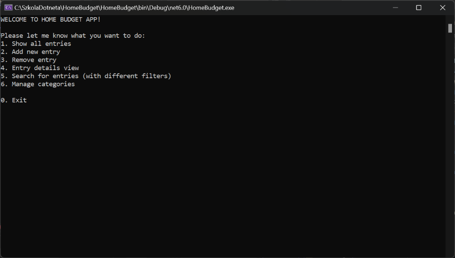

# HomeBudget
Console app developed as part of a C# course to manage personal finances.

- Developed a console application to manage personal finances, allowing users to add, view, and remove entries.
- Implemented search functionality with multiple filters for efficient data retrieval and entry management.
- Designed a category management system to organize and categorize budget entries for better financial tracking.

Technologies used: C#

More screenshots: [images](images/)
